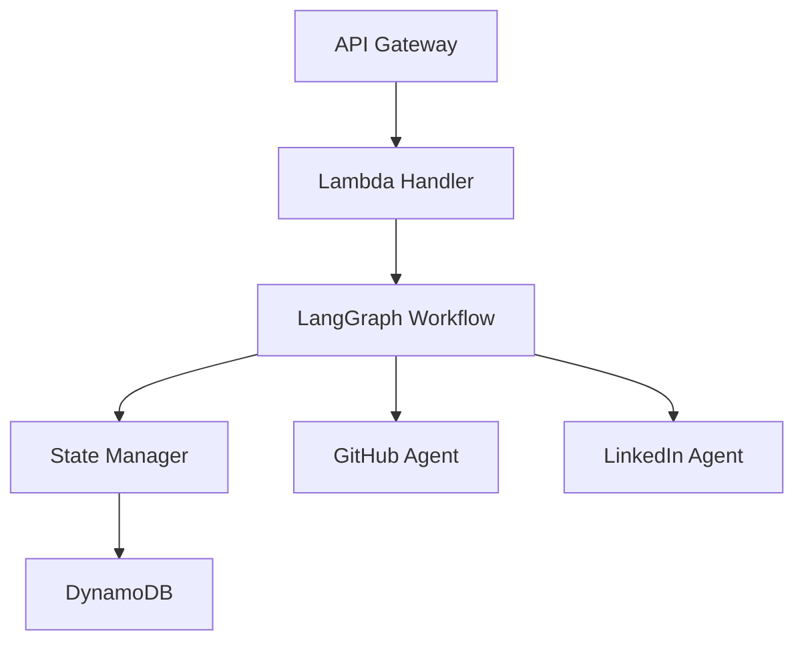

# LangGraph Integration Architecture

## 1. Overview

### 1.1 Integration Architecture


## 2. LangGraph Workflow Components

### 2.1 Graph Definition
```python
class WorkflowGraph:
    def __init__(self):
        self.workflow = MessageGraph()
        self._configure_nodes()
        self._configure_edges()
        self._set_entry_point()

    def _configure_nodes(self):
        """
        Configure workflow nodes:
        1. Task Analysis Node
        2. GitHub Processing Node
        3. LinkedIn Processing Node
        4. Data Aggregation Node
        """
        @self.workflow.node()
        async def task_analysis(state: AgentState) -> Dict[str, Any]:
            messages = state["messages"]
            last_message = messages[-1]
            
            # Process task using LLM
            # Extract repository information
            # Update state with analysis
            return {"next": "github_processing"}

        @self.workflow.node()
        async def github_processing(state: AgentState) -> Dict[str, Any]:
            # Process GitHub data
            # Update state
            return {"next": "linkedin_processing"}
```

### 2.2 State Management
```python
class AgentState(TypedDict):
    """Workflow state with AWS integration."""
    session_id: str
    messages: List[MessageDict]
    github_data: Dict[str, Any]
    linkedin_data: Dict[str, Any]
    final_response: Dict[str, Any]
    metadata: Dict[str, Any]

class StateManager:
    """Manage state in DynamoDB with LangGraph integration."""
    async def save_state(self, state: AgentState) -> None:
        # Convert state to DynamoDB format
        # Handle conditional writes
        # Maintain state history

    async def load_state(self, session_id: str) -> AgentState:
        # Retrieve latest state
        # Handle missing state
        # Convert to AgentState
```

## 3. Lambda Integration

### 3.1 Handler Configuration
```python
class LangGraphLambdaHandler:
    def __init__(self):
        self.workflow = WorkflowGraph()
        self.state_manager = StateManager()

    async def handle_request(
        self,
        event: Dict[str, Any],
        context: LambdaContext
    ) -> Dict[str, Any]:
        # Initialize or load state
        # Execute workflow step
        # Save updated state
        # Return response
```

### 3.2 State Persistence
```python
class DynamoDBStateStore:
    """DynamoDB state storage for LangGraph."""
    
    async def save_workflow_state(
        self,
        session_id: str,
        state: AgentState
    ) -> None:
        """Save workflow state with versioning."""
        item = {
            "session_id": session_id,
            "timestamp": datetime.now().isoformat(),
            "state": json.dumps(state),
            "version": uuid.uuid4().hex
        }
        await self.table.put_item(
            Item=item,
            ConditionExpression="attribute_not_exists(version)"
        )
```

## 4. Message Flow

### 4.1 Message Processing
```python
class MessageProcessor:
    """Process messages in LangGraph workflow."""
    
    async def process_message(
        self,
        message: Dict[str, Any],
        state: AgentState
    ) -> AgentState:
        # Update message history
        # Process with appropriate agent
        # Update state
        return updated_state
```

### 4.2 Agent Communication
```python
class AgentCommunication:
    """Handle inter-agent communication."""
    
    async def send_message(
        self,
        from_agent: str,
        to_agent: str,
        content: Dict[str, Any],
        state: AgentState
    ) -> None:
        # Add message to state
        # Trigger next agent
        # Handle errors
```

## 5. Error Handling

### 5.1 Workflow Error Handling
```python
class WorkflowErrorHandler:
    """Handle errors in LangGraph workflow."""
    
    async def handle_error(
        self,
        error: Exception,
        state: AgentState
    ) -> AgentState:
        # Log error
        # Update state
        # Determine recovery action
        return updated_state
```

### 5.2 State Recovery
```python
class StateRecovery:
    """Recover from state errors."""
    
    async def recover_state(
        self,
        session_id: str
    ) -> Optional[AgentState]:
        # Load previous valid state
        # Apply recovery logic
        # Validate recovered state
```

## 6. Monitoring and Observability

### 6.1 Workflow Metrics
```python
class WorkflowMetrics:
    """Track LangGraph workflow metrics."""
    
    async def record_metrics(
        self,
        state: AgentState,
        step: str
    ) -> None:
        # Record step duration
        # Track state size
        # Monitor agent performance
```

### 6.2 Tracing Integration
```python
class WorkflowTracer:
    """Trace LangGraph workflow execution."""
    
    def start_trace(
        self,
        session_id: str
    ) -> None:
        # Initialize X-Ray segment
        # Add workflow metadata
        # Track state transitions
```

## 7. Testing

### 7.1 Workflow Testing
```python
class WorkflowTester:
    """Test LangGraph workflow components."""
    
    async def test_workflow(
        self,
        input_state: AgentState
    ) -> AgentState:
        # Execute workflow
        # Validate state transitions
        # Check expected outcomes
```

### 7.2 Integration Testing
```python
class IntegrationTester:
    """Test AWS integration components."""
    
    async def test_integration(
        self,
        test_event: Dict[str, Any]
    ) -> None:
        # Test Lambda handler
        # Verify state persistence
        # Check error handling
```
