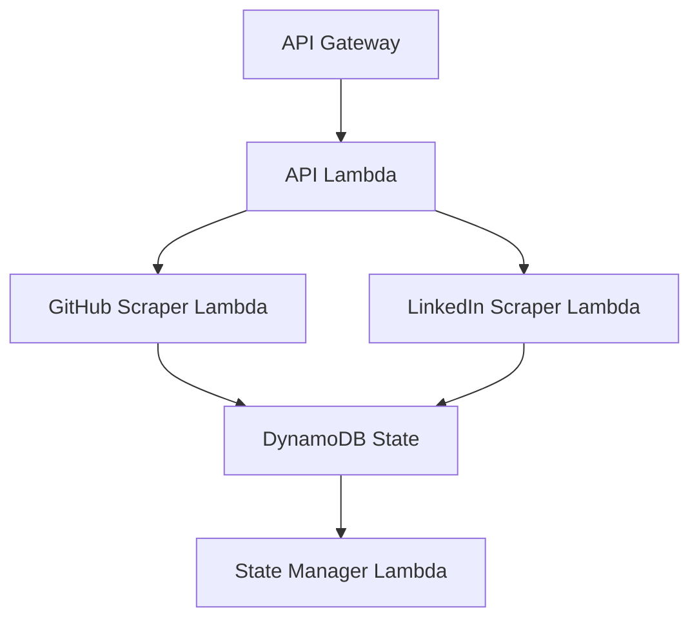
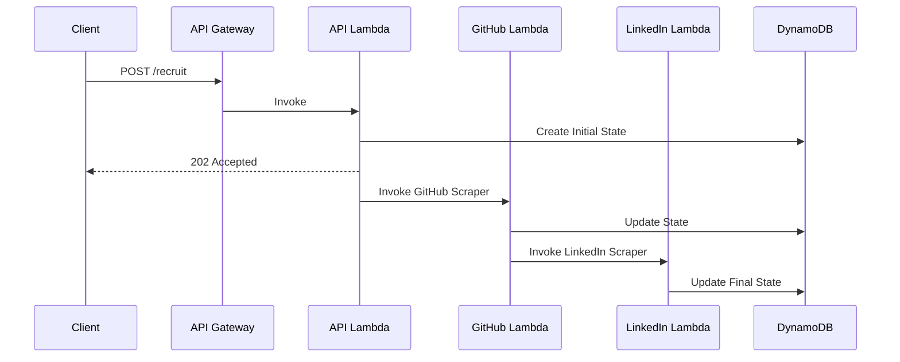
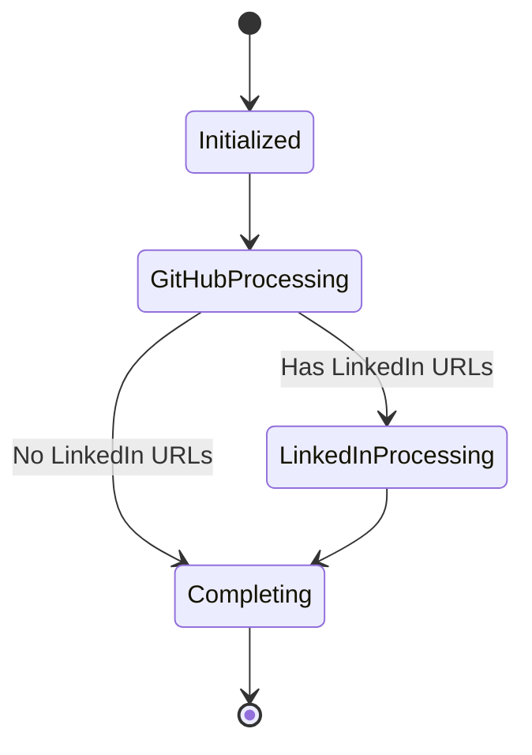
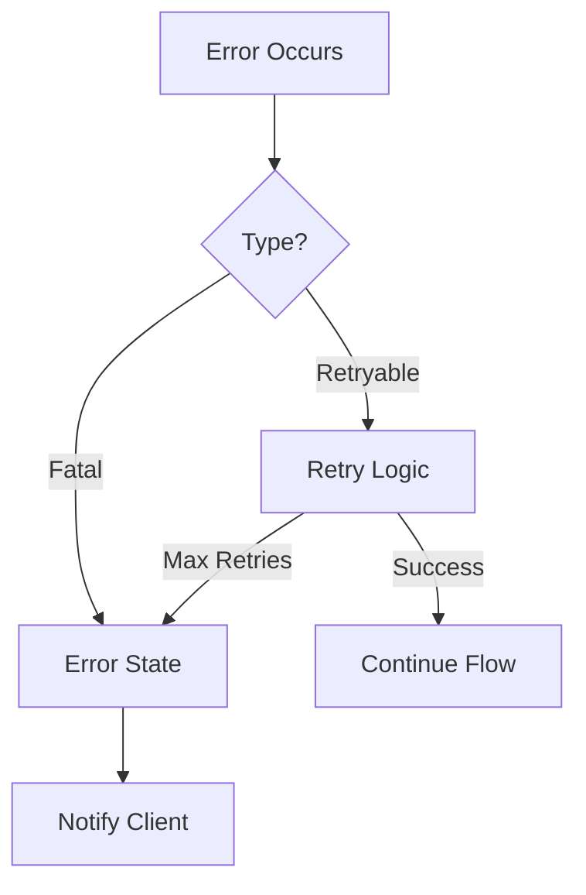
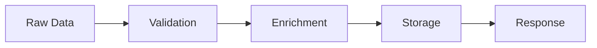
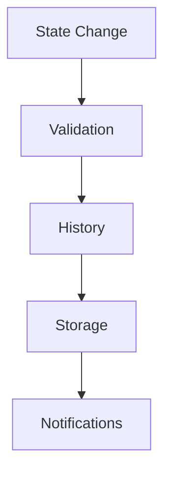
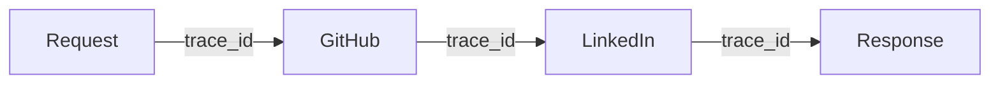
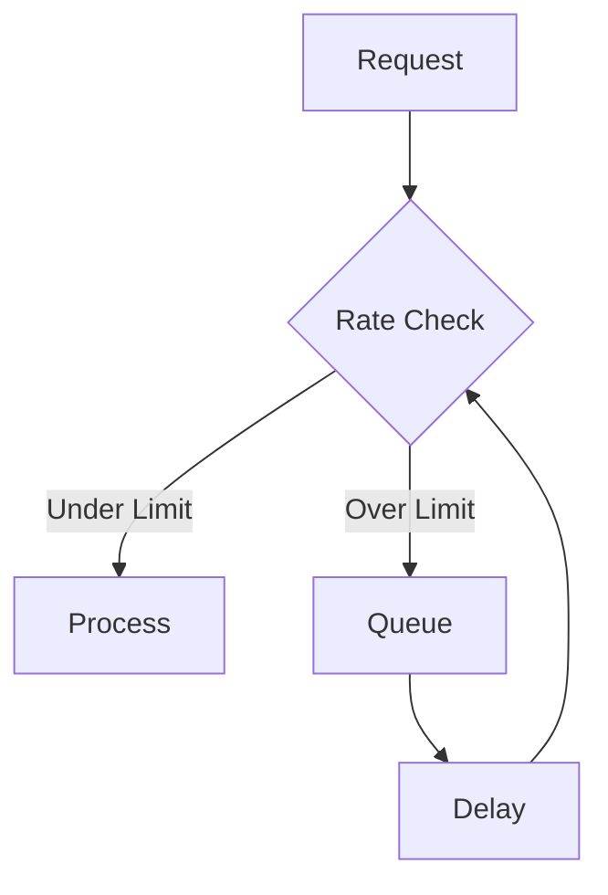
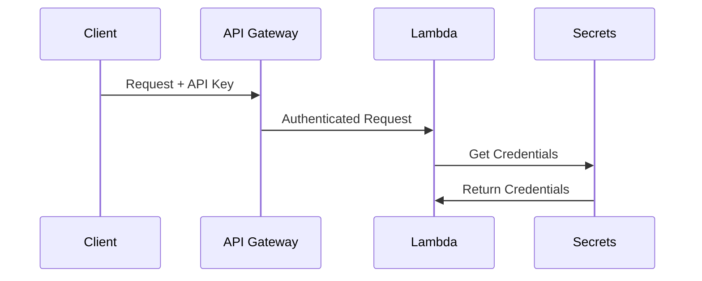

# Application Flow Documentation

## 1. High-Level Architecture

### 1.1 System Components


### 1.2 Event Flow


## 2. Detailed Workflow Steps

### 2.1 Request Processing
1. **API Request Handling**
   ```python
   async def process_request(event: Dict[str, Any]) -> Response:
       # Validate input
       # Create session
       # Initialize state
       # Trigger workflow
   ```

2. **State Initialization**
   ```python
   async def initialize_state(session_id: str) -> WorkflowState:
       # Create initial state
       # Set up workflow context
       # Save to DynamoDB
   ```

### 2.2 GitHub Processing
1. **Repository Analysis**
   ```mermaid
   graph LR
       A[Get Repository] --> B[List Contributors]
       B --> C[Process Each User]
       C --> D[Extract Metrics]
       D --> E[Update State]
   ```

2. **Contributor Processing**
   ```python
   async def process_contributor(
       username: str,
       repo: str
   ) -> GitHubProfile:
       # Get user details
       # Calculate metrics
       # Extract social links
       # Update state
   ```

### 2.3 LinkedIn Processing
1. **Profile Matching**
   ```mermaid
   graph TD
       A[Get LinkedIn URL] --> B{URL Valid?}
       B -->|Yes| C[Scrape Profile]
       B -->|No| D[Search by Name]
       C --> E[Process Profile]
       D --> E
       E --> F[Update State]
   ```

2. **Data Extraction**
   ```python
   async def extract_linkedin_data(
       profile_url: str
   ) -> LinkedInProfile:
       # Initialize scraper
       # Extract profile data
       # Process experience
       # Handle rate limits
   ```

## 3. State Management

### 3.1 State Transitions


### 3.2 State Updates
1. **Write Operations**
   ```python
   async def update_state(
       session_id: str,
       update_data: Dict[str, Any]
   ) -> None:
       # Validate update
       # Handle concurrency
       # Maintain history
   ```

2. **Read Operations**
   ```python
   async def get_latest_state(
       session_id: str
   ) -> WorkflowState:
       # Fetch latest
       # Handle missing data
       # Validate state
   ```

## 4. Error Handling

### 4.1 Error Flow


### 4.2 Recovery Procedures
```python
async def handle_error(
    error: Exception,
    context: Dict[str, Any]
) -> None:
    # Log error
    # Update state
    # Trigger recovery
    # Notify monitoring
```

## 5. Data Flow

### 5.1 Profile Data Flow


### 5.2 State Data Flow


## 6. Monitoring and Metrics

### 6.1 Metric Collection
```python
class MetricPoints:
    REQUEST_START = "request.start"
    GITHUB_PROCESSING = "github.processing"
    LINKEDIN_PROCESSING = "linkedin.processing"
    STATE_UPDATE = "state.update"
    REQUEST_END = "request.end"
```

### 6.2 Tracing Flow


## 7. Scaling Considerations

### 7.1 Concurrent Processing
```python
async def process_batch(
    profiles: List[str],
    batch_size: int = 10
) -> None:
    # Split into batches
    # Process concurrently
    # Handle failures
    # Merge results
```

### 7.2 Rate Limiting


## 8. Security Flow

### 8.1 Authentication Flow


### 8.2 Authorization Flow
```python
async def authorize_request(
    context: Dict[str, Any]
) -> bool:
    # Validate token
    # Check permissions
    # Rate limit check
    # Log access
```
