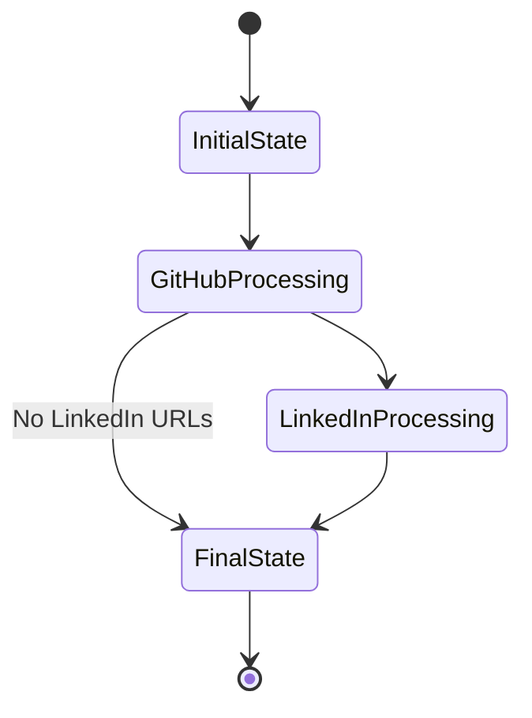

# Schema Design Documentation

## 1. Data Models

### 1.1 DynamoDB Tables

#### State Table
```json
{
    "TableName": "github-linkedin-analyzer-state",
    "KeySchema": [
        {
            "AttributeName": "session_id",
            "KeyType": "HASH"
        },
        {
            "AttributeName": "timestamp",
            "KeyType": "RANGE"
        }
    ],
    "AttributeDefinitions": [
        {
            "AttributeName": "session_id",
            "AttributeType": "S"
        },
        {
            "AttributeName": "timestamp",
            "AttributeType": "S"
        }
    ],
    "TTL": {
        "AttributeName": "ttl",
        "Enabled": true
    }
}
```

#### Cache Table
```json
{
    "TableName": "github-linkedin-analyzer-cache",
    "KeySchema": [
        {
            "AttributeName": "profile_id",
            "KeyType": "HASH"
        }
    ],
    "AttributeDefinitions": [
        {
            "AttributeName": "profile_id",
            "AttributeType": "S"
        }
    ],
    "TTL": {
        "AttributeName": "ttl",
        "Enabled": true
    }
}
```

### 1.2 State Management Models

#### WorkflowState
```python
class WorkflowState(BaseModel):
    session_id: str
    timestamp: datetime
    messages: List[MessageDict]
    github_data: Dict[str, Any] = {}
    linkedin_data: Dict[str, Any] = {}
    final_response: Dict[str, Any] = {}
```

#### MessageDict
```python
class MessageDict(TypedDict):
    content: str
    type: str
    name: Optional[str]
    metadata: Optional[Dict[str, Any]]
```

### 1.3 Profile Models

#### GitHubProfile
```python
class GitHubActivityMetrics(BaseModel):
    total_commits: int = 0
    total_prs: int = 0
    total_issues: int = 0
    recent_commits: int = 0
    recent_prs: int = 0
    recent_issues: int = 0
    languages: Dict[str, int] = {}

class GitHubContributor(BaseModel):
    username: str
    contributions: int
    repos: List[str]
    email: Optional[str]
    name: Optional[str]
    linkedin_url: Optional[str]
    activity_metrics: Optional[GitHubActivityMetrics]
    is_maintainer: bool = False
    last_active: Optional[datetime]
    role: Optional[str]
```

#### LinkedInProfile
```python
class LinkedInProfile(BaseModel):
    profile_url: str
    name: str
    current_position: Optional[str]
    company: Optional[str]
    location: Optional[str]
    industry: Optional[str]
    experience: List[Dict[str, Any]]
    education: List[Dict[str, Any]]
    skills: List[str]
    languages: List[str]
    summary: Optional[str]
    recommendations: List[Dict[str, Any]]
    certifications: List[Dict[str, Any]]
    volunteer: List[Dict[str, Any]]
```

## 2. State Management

### 2.1 State Transitions


### 2.2 State Storage Format
```json
{
    "session_id": "uuid-v4",
    "timestamp": "2024-01-01T00:00:00Z",
    "state": {
        "messages": [
            {
                "content": "Processing started",
                "type": "system",
                "metadata": {
                    "step": "initial"
                }
            }
        ],
        "github_data": {
            "repository": "owner/repo",
            "contributors": []
        },
        "linkedin_data": {
            "profiles": []
        },
        "final_response": {}
    },
    "ttl": 1704067200
}
```

## 3. Cache Management

### 3.1 Profile Cache Format
```json
{
    "profile_id": "github:username",
    "data": {
        "profile_type": "github",
        "username": "username",
        "profile_url": "https://github.com/username",
        "cached_at": "2024-01-01T00:00:00Z"
    },
    "ttl": 1704067200
}
```

### 3.2 Cache Keys
- GitHub Profiles: `github:{username}`
- LinkedIn Profiles: `linkedin:{profile_id}`
- Repository Data: `repo:{owner}/{repo}`

## 4. API Schemas

### 4.1 Request Schema
```json
{
    "task_description": "string",
    "limit": "integer",
    "include_metrics": "boolean"
}
```

### 4.2 Response Schema
```json
{
    "repository": "string",
    "total_profiles": "integer",
    "profiles_with_linkedin": "integer",
    "profiles": [
        {
            "github_info": {},
            "linkedin_info": {},
            "combined_metrics": {}
        }
    ]
}
```

## 5. Schema Evolution

### 5.1 Version Management
- Schema version tracking
- Backward compatibility
- Migration strategies
- Data validation

### 5.2 Migration Patterns
```python
async def migrate_state_v1_to_v2(state: Dict[str, Any]) -> Dict[str, Any]:
    """Migrate state from v1 to v2 format."""
    if state.get("version") == 1:
        # Migration logic
        state["version"] = 2
    return state
```

## 6. Data Retention

### 6.1 TTL Configuration
- State Data: 24 hours
- Cache Data: 1 hour
- Error Logs: 30 days
- Metrics: 90 days

### 6.2 Cleanup Policies
```python
class CleanupPolicy(BaseModel):
    table_name: str
    ttl_attribute: str
    default_ttl: int
    max_ttl: int
    cleanup_batch_size: int = 100
```

## 7. Schema Validation

### 7.1 Validation Rules
```python
class ValidationRules(BaseModel):
    max_message_length: int = 1000
    max_profiles_per_request: int = 100
    allowed_message_types: List[str] = [
        "system",
        "user",
        "error"
    ]
```

### 7.2 Type Safety
- Pydantic models
- Runtime validation
- Type checking
- Error handling
